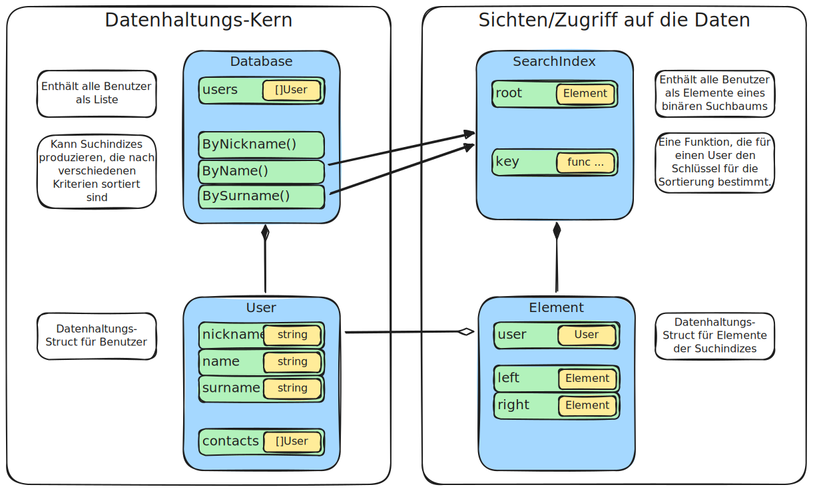

# Soziales Netzwerk

Dieses Projekt soll die Verwendung verschiedener Algorithmen und Datenstrukturen
anhand eines einfachen sozialen Netzwerks zeigen

Es werden Basis-Datentypen für Benutzer und deren Beziehungen definiert
und in einer allgmeinen Datenstruktur gespeichert, die es ermöglicht,
die Benutzer anhand verschiedener Suchkriterien auffindbar zu machen.

Außerdem wird eine Abfragemöglichkeit implementiert, um Informationen über die
Kontakte eines Benutzers zu erhalten.

## Datentypen

